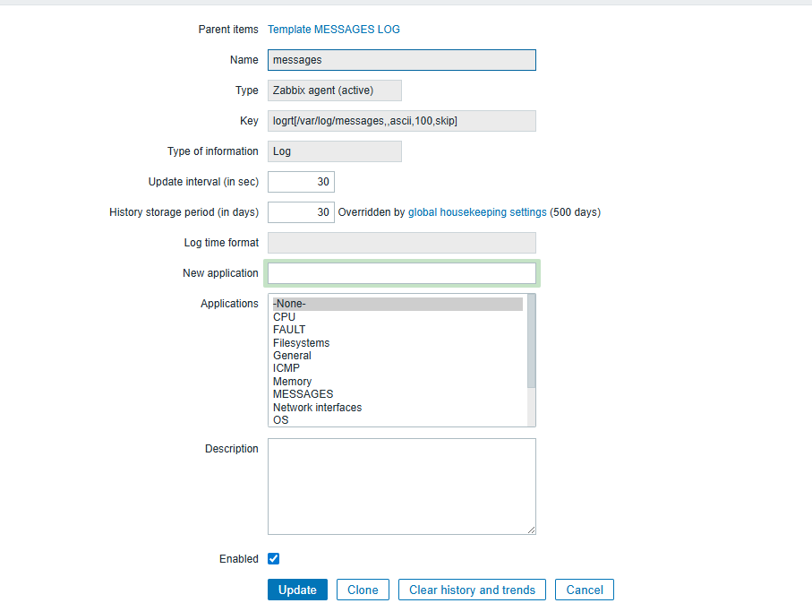

# 이미지 관리 가이드라인

## 디렉터리 구조

```
assets/images/
├── monitoring/                # 모니터링 관련 이미지
│   ├── zabbix/               # Zabbix 관련 이미지
│   │   ├── item/             # Item 관련 스크린샷 및 다이어그램
│   │   ├── trigger/          # Trigger 관련 이미지
│   │   ├── action/           # Action 관련 이미지
│   │   └── best-practices/   # 모범 사례 다이어그램
│   ├── prometheus/           # Prometheus 관련 이미지
│   └── grafana/              # Grafana 관련 이미지
├── reference/                # Reference 문서 관련 이미지
└── general/                  # 공통 이미지
```

## 이미지 파일 명명 규칙

### 1. 파일명 형식
- 소문자와 하이픈(-) 사용
- 공백 대신 하이픈 사용
- 예: `zabbix-item-structure.png`

### 2. 접두사 규칙
- `zabbix-`: Zabbix 관련 이미지
- `ref-`: Reference 문서 관련 이미지
- `gen-`: 공통 이미지

## 이미지 사용 방법

### Markdown에서 이미지 삽입
```markdown

```

### 상대 경로 사용 (같은 섹션 내에서)
```markdown

```

## 권장 이미지 형식

### 스크린샷
- **형식**: PNG (투명도 지원)
- **해상도**: 최소 1200px 너비
- **압축**: 적절한 품질 유지

### 다이어그램
- **형식**: PNG 또는 SVG (벡터)
- **색상**: 웹 안전 색상 사용
- **크기**: 800x600px 이상

## 이미지 최적화

### 파일 크기
- 스크린샷: 500KB 이하
- 다이어그램: 200KB 이하
- 아이콘: 50KB 이하

### 도구 추천
- **PNG 최적화**: TinyPNG, ImageOptim
- **스크린샷**: ShareX, Lightshot
- **다이어그램**: Draw.io, Lucidchart

## 주의사항

1. **저작권**: 저작권이 있는 이미지 사용 금지
2. **개인정보**: 개인정보가 포함된 스크린샷 사용 금지
3. **백업**: 원본 이미지 파일 보관
4. **버전 관리**: 이미지 변경 시 이력 관리 