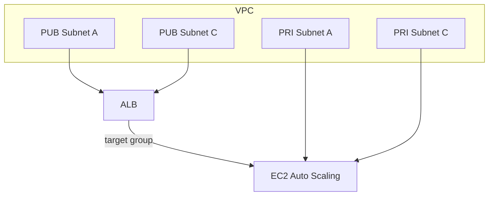

## 개요
VPC, Subnet, SG, ALB, EC2, S3, IAM을 모듈화하여 환경별로 조합합니다.

## 다이어그램(개념)

```mermaid
flowchart TB
  subgraph VPC
    PUB1[PUB Subnet A]
    PUB2[PUB Subnet C]
    PRI1[PRI Subnet A]
    PRI2[PRI Subnet C]
  end

  ALB[ALB]
  ASG[EC2 Auto Scaling]

  ALB -->|target group| ASG
  PUB1 --> ALB
  PUB2 --> ALB
  PRI1 --> ASG
  PRI2 --> ASG
```

