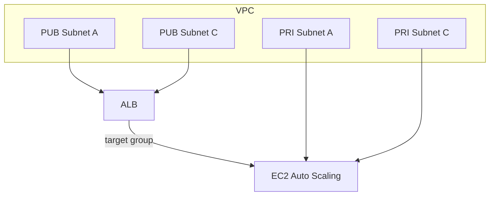

## 개요
VPC, Subnet, SG, ALB, EC2, S3, IAM을 모듈화하여 환경별로 조합합니다.

## 다이어그램(개념)


## 모듈 구성 개요
프로젝트는 서비스별로 모듈화되어 있으며 환경(`dev/staging/prod`)에서 조합합니다.

```text
modules/
  vpc/              # VPC, 서브넷, 라우트, IGW/NAT
  security-groups/  # 공통 SG 정책
  alb/              # ALB 및 Target Group/Listener
  ec2/              # ASG/Launch Template
  rds/              # RDS 인스턴스/파라미터
  s3/               # S3 버킷 및 정책
  iam/              # 역할/정책/프로필
```

환경별 디렉터리는 서비스 단위로 모듈을 호출합니다.

```text
environments/{dev,staging,prod}/
  networking/  # VPC, SG, ALB 등 네트워크 계층
  compute/     # EC2/ASG 등 컴퓨트 계층
  database/    # RDS 등 데이터 계층
  storage/     # S3 등 스토리지 계층
```

## 구성 원칙
- 모듈은 단일 책임을 지향하고 입출력 변수를 명확히 정의합니다.
- 교차 의존성은 `terraform_remote_state` 또는 명시적 출력값을 통해 연결합니다.
- 환경별 차이는 `terraform.tfvars`로 주입하고, 공통값은 모듈 변수의 기본값으로 유지합니다.
- 변경의 파급을 최소화하기 위해 상위(네트워킹) → 하위(컴퓨트/데이터) 순으로 배포합니다.

## 예시: VPC 모듈 핵심 블록
```terraform
resource "aws_vpc" "main" {
  cidr_block           = var.vpc_cidr
  enable_dns_hostnames = true
  enable_dns_support   = true

  tags = merge(var.tags, {
    Name = "${var.project_name}-${var.environment}-vpc"
  })
}

resource "aws_subnet" "public" {
  count = length(var.availability_zones)

  vpc_id                  = aws_vpc.main.id
  cidr_block              = var.public_subnet_cidrs[count.index]
  availability_zone       = var.availability_zones[count.index]
  map_public_ip_on_launch = true
}
```

## 예시: 환경에서 모듈 호출
```terraform
module "vpc" {
  source = "../../../modules/vpc"

  project_name          = var.project_name
  environment           = var.environment
  vpc_cidr              = var.vpc_cidr
  availability_zones    = var.availability_zones
  public_subnet_cidrs   = var.public_subnet_cidrs
  private_subnet_cidrs  = var.private_subnet_cidrs
  enable_nat_gateway    = true
}
```

## 예시: ALB 모듈 핵심 블록
```terraform
resource "aws_lb" "main" {
  name               = "${var.project_name}-${var.environment}-alb"
  load_balancer_type = "application"
  security_groups    = [aws_security_group.alb.id]
  subnets            = var.public_subnet_ids
}

resource "aws_lb_target_group" "main" {
  name     = "${var.project_name}-${var.environment}-tg"
  port     = 80
  protocol = "HTTP"
  vpc_id   = var.vpc_id
}
```

## 예시: EC2 모듈 핵심 블록
```terraform
data "aws_ami" "amazon_linux" {
  most_recent = true
  owners      = ["amazon"]
}

resource "aws_launch_template" "main" {
  instance_type = var.instance_type
  image_id      = data.aws_ami.amazon_linux.id
}

resource "aws_autoscaling_group" "main" {
  vpc_zone_identifier = var.subnet_ids
  desired_capacity    = var.desired_capacity
  min_size            = var.min_size
  max_size            = var.max_size
}
```

